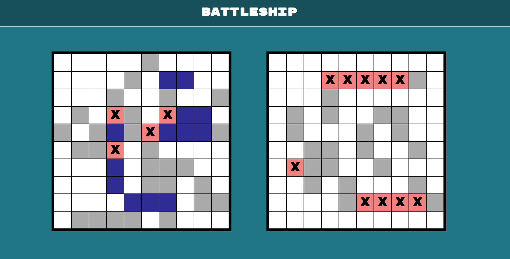

# Battleship

Compete against the computer in the classic game of "Battleship." Implemented using vanilla JavaScript.



## Installation and Usage

Clone the repository and navigate into the directory. Run:

```bash
npm install
```

To run the game in a development environment:
```bash
npm run dev
```

To run test fixtures: 
```bash
npm test
```

## Lessons Learned

- Setting up and unit-testing with Jest.
- Enumerating different states makes it easier to keep track of game logic.
- More time should be spent in the planning stage determining how different components of the project should interact.

## Future Implementations

- Drag and drop board setup for the user
- Dashboard displaying each user's fleet and sunk ships
- Integrate AI or algorithmic logic for CPU play